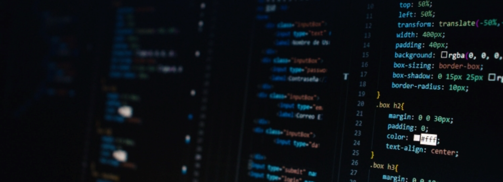

<h1 align="center">Hi 👋, I'm Lucia</h1>

I am a Web Developer with a keen interest in <b>open source collaborations</b>

## About Me

- 🔭 I’m currently working on **a JavaScript Project**
- 💬 Ask me about **HTML, CSS, Bootstrap, JavaScript**
- 🌱 I’m currently learning **ReactJs and Open source**
- 👯 I’m looking to collaborate on **any open source projects using HTML, CSS, Javascript**

<!--
**ChinatuL/ChinatuL** is a ✨ _special_ ✨ repository because its `README.md` (this file) appears on your GitHub profile.

Here are some ideas to get you started:

- 🤔 I’m looking for help with ...

- 📫 How to reach me: ...
- 😄 Pronouns: ...
- ⚡ Fun fact: ...
-->
